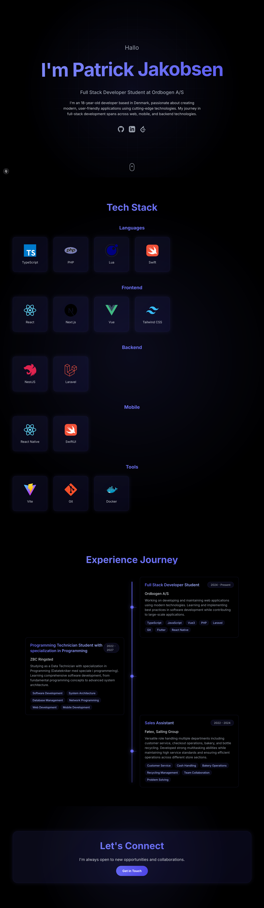

# Patrick Jakobsen's Portfolio

A modern, responsive portfolio website built with Next.js, showcasing my skills, experience, and projects as a Full Stack Developer.



## 🌟 Features

- Responsive design that works on all devices
- Smooth animations and transitions using Framer Motion
- Dynamic greeting messages in multiple languages
- Interactive tech stack showcase
- Timeline-based experience section
- Project portfolio with filtering capabilities
- Dark theme with modern UI elements
- Contact section with direct email link

## 🛠️ Built With

- [Next.js 14](https://nextjs.org/) - React framework
- [TypeScript](https://www.typescriptlang.org/) - Programming language
- [Tailwind CSS](https://tailwindcss.com/) - CSS framework
- [Framer Motion](https://www.framer.com/motion/) - Animation library
- [React Icons](https://react-icons.github.io/react-icons/) - Icon library

## 🚀 Getting Started

### Prerequisites

- Node.js (v18 or higher)
- npm or yarn or pnpm

### Installation

1. Clone the repository
```bash
git clone https://github.com/yourusername/portfolio.git
```

2. Install dependencies
```bash
npm install
# or
yarn install
# or
pnpm install
```

3. Run the development server
```bash
npm run dev
# or
yarn dev
# or
pnpm dev
```

4. Open [http://localhost:3000](http://localhost:3000) with your browser to see the result.

## 📁 Project Structure

```
├── app/
│   ├── components/     # Reusable UI components
│   ├── styles/        # Global styles and Tailwind config
│   └── page.tsx       # Main portfolio page
├── public/            # Static assets
│   ├── icons/         # Tech stack icons
│   └── images/        # Project images
└── README.md
```

## 🎨 Customization

1. Update personal information in `app/page.tsx`
2. Modify the tech stack in the `techStack` object
3. Add your projects to the `projects` array
4. Update the timeline items in the `timeline` array
5. Customize colors and styling in `tailwind.config.js`

## 📱 Responsive Design

The portfolio is fully responsive and optimized for:
- Mobile devices (320px and up)
- Tablets (768px and up)
- Desktops (1024px and up)
- Large screens (1280px and up)

## 🔧 Development

```bash
# Run development server
npm run dev

# Build for production
npm run build

# Start production server
npm start

# Run linter
npm run lint
```

## 📄 License

This project is licensed under the MIT License - see the [LICENSE](LICENSE) file for details.

## 📬 Contact

Patrick Jakobsen - [contactpatrickjak@icloud.com](mailto:contactpatrickjak@icloud.com)

Project Link: [https://github.com/yourusername/portfolio](https://github.com/Pallepadehat/patrickjakobsen)

## 🙏 Acknowledgments

- [Next.js Documentation](https://nextjs.org/docs)
- [Tailwind CSS Documentation](https://tailwindcss.com/docs)
- [Framer Motion Documentation](https://www.framer.com/motion/)
